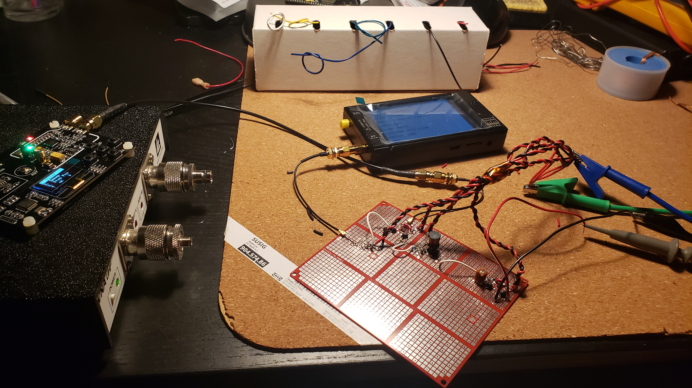
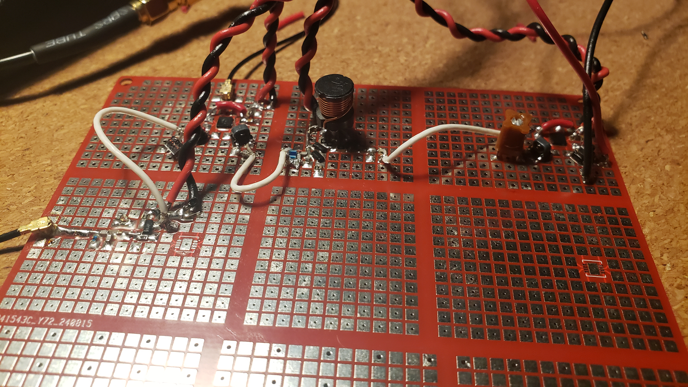
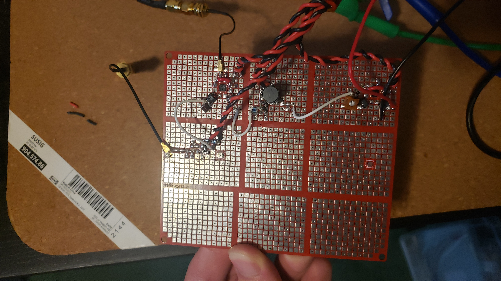
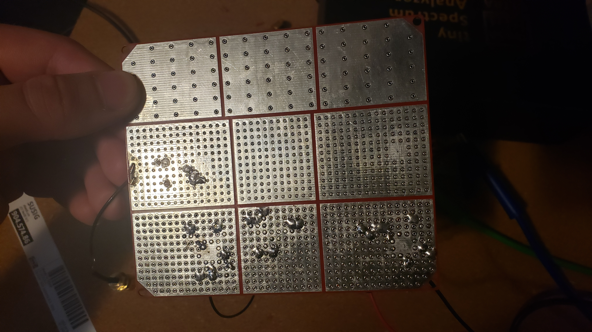

# FM Receiver
The motivation behind this project is to become familiar with RF circuits, and attain an understanding of the much taken-for-granted technology of radio.

The [FM_Receiver_HighLevelDesignDoc.pdf](./FM_Receiver_HighLevelDesignDoc.pdf) provides a high-level design description of the project, along with component selection. 
The [FM_Receiver_Calculations.pdf](./FM_Receiver_Calculations.pdf) provides the majority of the calculations and decision-making process of the design.

 The following images show the fully assembled first version of the "FM Receiver":

I'm using a tinySA Ultra to drive the input with a FM modulated signal, an OTS LO board and a VNAuhf by Array Solutions for impedance measurements.

Prior to functionality tests, the input impedance was measured to be around 20 Ohms reactive. However, the intended input impedance was 50 Ohms resistive, thus the input's impedance matching stage and/or the LNA needs reworking. 

Due to my access to lab tools being time-constrained, I couldn't test each stage individually. This will need to be done in the future.
